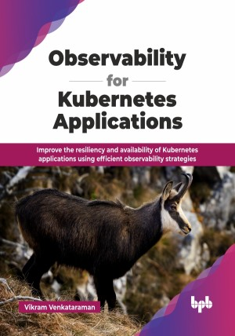

# Observability for Kubernetes Applications

Improve the resiliency and availability of Kubernetes applications using efficient observability strategies.

This is the repository for [Observability for Kubernetes Applications
](https://bpbonline.com/products/observability-for-kubernetes-applications?variant=44489913237704),published by BPB Publications.

## About the Book
Explore the dynamic intersection of Kubernetes and observability in this comprehensive guide Observability for Kubernetes Application. This book explains the intricacies of monitoring, logging, and tracing within the Kubernetes environment. Uncover practical strategies for mastering the telemetry signals to get a holistic understanding of system behavior.

This technical guide provides a comprehensive coverage of Kubernetes observability, progressing from fundamental principles to advanced implementation patterns. It examines the three pillars - metrics, logs, and traces - alongside their collection and correlation methodologies. The book explores tool selection, OpenTelemetry standardization, and instrumentation techniques while diving into KPI implementation and eBPF profiling. Advanced topics cover multi-cloud observability, platform scaling, and AI-driven approaches, providing practical solutions for establishing robust observability in Kubernetes environments.

Our aim is to provide you with convenient ways to master the telemetry signals using the right tools and future-proofing strategies. This book equips you to navigate the complexities of modern container orchestration by elevating the monitoring practices, and ensuring the application is available at all times.

## What You Will Learn
• Build a key observability platform to make apps strong and reliable.

• Understand core observability ideas using easy Kubernetes examples.

• Use metrics, logs, and traces to get vital app insights.

• Find and fix Kubernetes errors fast by linking data signals.

• Securely scale your platform using smart cost and security tips.

• Apply AI to monitor Kubernetes and automate issue resolution.
